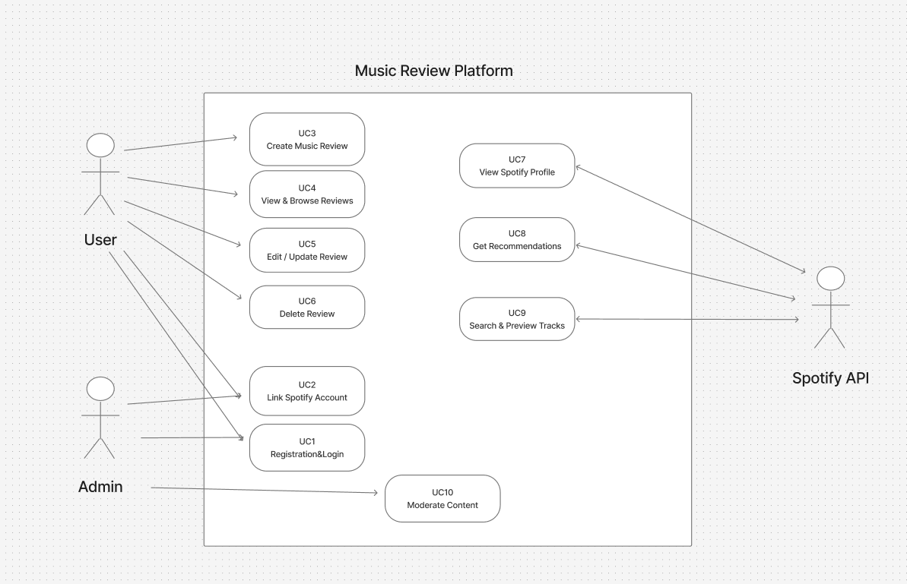

# Features and Use Cases

## Features
- User Authentication and Spotify Integration
- Music Track Review System
- Spotify Profile Integration
- Track Search 
- Music Recommendations
- User Activity (Recently Played/Top Tracks)

## Brief Use Cases

### UC1: User Registration and Login
- Primary Actor: User
- Goal: Create an account and authenticate to access the platform

### UC2: Link Spotify Account
- Primary Actor: User
- Goal: Connect Spotify account to enable music data integration and profile features

### UC3: Create Music Review
- Primary Actor: User
- Goal: Search for a track, rate it (1-5 stars), and optionally add a comment (max 300 words)

### UC4: View and Browse Reviews
- Primary Actor: User
- Goal: Browse, filter, sort, and paginate through music reviews from other users

### UC5: Edit/Update Review
- Primary Actor: User
- Goal: Modify rating or comment of an existing review

### UC6: Delete Review
- Primary Actor: User
- Goal: Remove a previously created review

### UC7: View Spotify Profile Data
- Primary Actor: User
- Goal: Display user's Spotify profile, recently played tracks, and top tracks

### UC8: Get Music Recommendations
- Primary Actor: User
- Goal: Generate personalized music recommendations based on listening history and preferences

### UC9: Search and Preview Tracks
- Primary Actor: User
- Goal: Search for music tracks and preview them before reviewing

### UC10: Moderate Content
- Primary Actor: Admin
- Goal: Manage users, moderate reviews, and view system logs

## Use Case Traceability

| Use Case | Feature(s) |
|---|---|
| UC1: User Registration and Login | User Authentication and Spotify Integration |
| UC2: Link Spotify Account | User Authentication and Spotify Integration, Spotify Profile Integration |
| UC3: Create Music Review | Music Track Review System, Track Search and Preview |
| UC4: View and Browse Reviews | Music Track Review System |
| UC5: Edit/Update Review | Music Track Review System |
| UC6: Delete Review | Music Track Review System |
| UC7: View Spotify Profile Data | Spotify Profile Integration, User Activity Tracking |
| UC8: Get Music Recommendations | Music Recommendations, User Activity Tracking |
| UC9: Search and Preview Tracks | Track Search and Preview |
| UC10: Moderate Content | User Authentication and Spotify Integration, Music Track Review System |

## Use Case Diagram
Include your diagram image below.

## Detailed Use Cases

### UC1: User Registration and Login
**Primary Actor:**  User  
**Goal:**  Create an account and authenticate to access the platform  
**Preconditions:**  User does not have an active account
**Success Outcome:**  User is authenticated and redirected to their dashboard with an active account  

** Main Flow **
1. User navigates to registration/login page.
2. User provides email and password (registration) or credentials (login).
3. System validates credentials and format.
4. System creates user account (registration) or verifies credentials (login).
5. System establishes authenticated session and redirects user to dashboard.

** Alternate Flow **
- A1: Email format invalid or password does not meet requirements → system displays validation error and user remains on form.
- A2: Email already registered (registration) → system displays error; user directed to login.
- A3: Invalid credentials (login) → system displays authentication error; user remains on login page.

### UC2: Link Spotify Account
**Primary Actor:**  User  
**Goal:**  Connect Spotify account to enable music data integration and profile features  
**Preconditions:**  User is authenticated but Spotify account is not yet linked  
**Success Outcome:**  User's Spotify account is successfully linked and authorized, system can access user's Spotify data  

** Main Flow **
1. User initiates Spotify account linking from profile or settings.
2. System redirects user to Spotify OAuth authorization page.
3. User authorizes the application with Spotify.
4. Spotify redirects back to application with authorization code.
5. System exchanges code for access and refresh tokens.
6. System stores tokens and retrieves basic Spotify profile data.
7. System confirms successful linking and displays Spotify profile information.

** Alternate Flow **
- A1: User denies authorization → Spotify redirects back with error then system notifies user and Spotify remains unlinked.
- A2: Token exchange fails → system logs error and displays generic connection error to user.
- A3: Spotify account already linked to another user → system displays error and prevents duplicate linking.

### UC3: Create Music Review
**Primary Actor:**  User  
**Goal:**  Search for a track, rate it (1-5 stars), and optionally add a comment  
**Preconditions:**  User is authenticated and Spotify integration is linked  
**Success Outcome:**  Review is created, stored in database, and displayed on the track's review page  

** Main Flow **
1. User searches for a track by name or artist.
2. System queries Spotify API and displays matching tracks with preview data.
3. User selects desired track.
4. User provides star rating (1-5) and optional comment (max 300 words).
5. System validates rating and comment length.
6. System creates review record associated with user and track.
7. System displays confirmation and redirects to track review page or user's reviews.

** Alternate Flow **
- A1: Search returns no results → system displays "no tracks found" message.
- A2: Comment exceeds 300 words → system displays validation error that user must shorten comment.
- A3: User already reviewed this track → system displays error or redirects to edit existing review (see UC5).
- A4: Spotify API unavailable → system displays error and cannot complete review creation.

### UC4: View and Browse Reviews
**Primary Actor:**  User  
**Goal:**  Browse, filter, sort, and paginate through music reviews from other users  
**Preconditions:**  At least one review exists in the system  
**Success Outcome:**  User views paginated, filtered, and sorted list of reviews  

** Main Flow **
1. User navigates to reviews page or track detail page.
2. System retrieves reviews based on current filters, sort order, and page number (default: recent, page 1).
3. System displays reviews with track info, rating, comment preview, and reviewer name.
4. User optionally applies filters (by rating, date, track) or changes sort order.
5. System re-queries and displays updated review list.
6. User navigates between pages using pagination controls.

** Alternate Flow **
- A1: No reviews match filter criteria → system displays "no reviews found" message.
- A2: User requests page beyond available results → system displays last valid page or error message.

### UC5: Edit/Update Review
**Primary Actor:**  User  
**Goal:**  Modify rating or comment of an existing review  
**Preconditions:**  User is authenticated and user owns the review to be edited  
**Success Outcome:**  Review is updated with new rating and/or comment and changes are persisted  

** Main Flow **
1. User navigates to their reviews list.
2. User selects "Edit" on an existing review.
3. System displays review form pre-populated with current rating and comment.
4. User modifies rating and/or comment.
5. System validates updated data (rating 1-5, comment <=300 words).
6. System updates review record with new values and timestamp.
7. System displays confirmation and updated review.

** Alternate Flow **
- A1: User attempts to edit review they don't own → system returns authorization error.
- A2: Comment exceeds 300 words → system displays validation error; changes not saved.
- A3: User cancels edit → system returns to review list without changes.

### UC6: Delete Review
**Primary Actor:**  User  
**Goal:**  Remove a previously created review  
**Preconditions:**  User is authenticated and user owns the review to be deleted  
**Success Outcome:**  Review is permanently removed from the system  

** Main Flow **
1. User navigates to their reviews list.
2. User selects "Delete" on an existing review.
3. System prompts for confirmation.
4. User confirms deletion.
5. System removes review record from database.
6. System displays confirmation message and updated reviews list.

** Alternate Flow **
- A1: User attempts to delete review they don't own → system returns authorization error.
- A2: User cancels deletion → system returns to reviews list without changes.
- A3: Review not found (already deleted or invalid ID) → system displays error message.

### UC7: View Spotify Profile Data
**Primary Actor:**  User  
**Goal:**  Display user's Spotify profile, recently played tracks, and top tracks  
**Preconditions:**  User is authenticated; Spotify account is linked and valid access token exists  
**Success Outcome:**  User views their Spotify profile information, recently played tracks, and top tracks  

** Main Flow **
1. User navigates to their profile or Spotify data page.
2. System retrieves user's Spotify profile information using stored access token.
3. System queries Spotify API for recently played tracks.
4. System queries Spotify API for top tracks.
5. System displays profile data, recently played tracks, and top tracks with album art and track details.

** Alternate Flow **
- A1: Access token expired → system attempts to refresh token using refresh token, if successful, it continues. if fails, it prompts user to re-link Spotify.
- A2: Spotify API unavailable → system displays cached data or error message.
- A3: User has no listening history → system displays "no data available" message for recently played/top tracks.

### UC8: Get Music Recommendations
**Primary Actor:**  User  
**Goal:**  Generate personalized music recommendations based on listening history and preferences  
**Preconditions:**  User is authenticated, Spotify account is linked, and user has listening history  
**Success Outcome:**  System displays personalized track recommendations with preview and review options  

** Main Flow **
1. User navigates to recommendations page.
2. System retrieves user's top tracks and/or recently played tracks from Spotify.
3. System calls Spotify recommendations API using user's music preferences as seed.
4. System displays recommended tracks with album art, artist, and preview player.
5. User optionally previews tracks or navigates to review them.

** Alternate Flow **
- A1: User has insufficient listening history → system uses genre-based or popular track recommendations.
- A2: Spotify API unavailable → system displays cached recommendations or error message.
- A3: No recommendations available → system suggests user listen to more music or explore popular tracks.

### UC9: Search and Preview Tracks
**Primary Actor:**  User  
**Goal:**  Search for music tracks and preview them before reviewing  
**Preconditions:**  User is authenticated and Spotify account is linked  
**Success Outcome:**  User finds desired track and previews it before proceeding to review  

** Main Flow **
1. User enters search query (track name, artist, or album) in search field.
2. System queries Spotify API with search terms.
3. System displays search results with track name, artist, album, and album art.
4. User selects a track to preview.
5. System displays track details with embedded preview player (if available).
6. User listens to 30-second preview.
7. User optionally proceeds to create review for the track.

** Alternate Flow **
- A1: Search returns no results → system displays "no tracks found" message and suggests refining search.
- A2: Preview not available for track → system displays message and allows user to proceed to review without preview.
- A3: Spotify API unavailable → system displays error message and search cannot be performed.

### UC10: Moderate Content
**Primary Actor:**  Admin  
**Goal:**  Manage users, moderate reviews, and view system logs  
**Preconditions:**  User is authenticated with Admin role  
**Success Outcome:**  Admin successfully performs moderation action (delete review, suspend user, etc.)  

** Main Flow **
1. Admin navigates to admin dashboard.
2. System displays moderation tools: flagged reviews, user list, system logs.
3. Admin selects action (delete review, suspend user, view logs).
4. System prompts for confirmation.
5. Admin confirms action.
6. System executes action and logs moderation event.
7. System displays confirmation and updated state.

** Alternate Flow **
- A1: Non-admin user attempts access → system returns authorization error.
- A2: Admin cancels action → system returns to dashboard without changes.
- A3: Target resource (review/user) not found → system displays error message.
